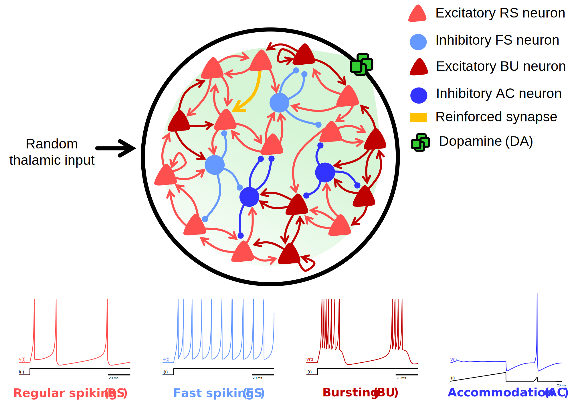

# heterogeneous-izhikevich

## Spiking neural network of Izhikevich neurons with DA-STDP learning.

This project implements a task based on Izhikevich (2007) to reinforce the firing activity of two specific neurons in response to delayed rewards. The network uses dopamine-modulated spike-timing-dependent plasticity (DA-STDP) to strengthen synaptic connections.

The network consists of 1000 neurons with 100 connections per neuron and a 4:1 excitatory-to-inhibitory ratio. It includes diverse spiking populations modeled with Izhikevich neurons, featuring regular spiking (RS), fast spiking (FS), bursting (BU), and accommodation (AC) behaviors. These populations are defined by varying a,b,c,da,b,c,d parameters.

Rewards are delivered 1–3 seconds after pre- and post-synaptic spikes align within a 20 ms window. Dopamine released upon reward enhances synaptic strengths through DA-STDP, reinforcing the desired activity.

This repository includes an analysis of how the proportions of different neuron types affect learning dynamics. Details are provided in the accompanying [PDF presentation](251024-analysis.pdf).

## Reference
- Izhikevich, E. M. (2007). *Solving the distal reward problem through linkage of STDP and dopamine signaling*.
