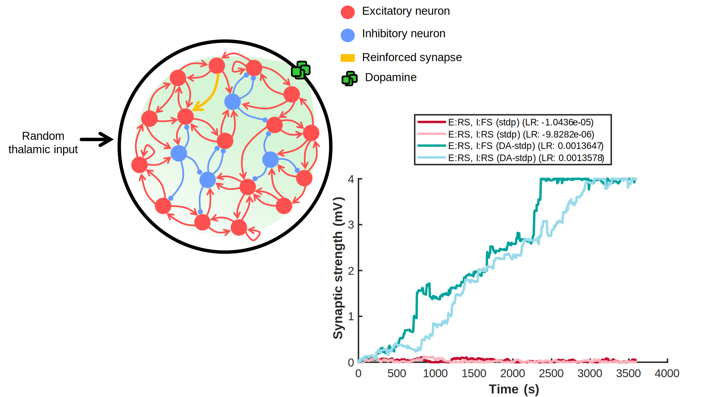

# heterogeneous-izhikevich
Spiking neural network of Izhikevich neurons with DA-STDP learning.

## Dopamine-Modulated Spiking Neural Network (DA-STDP)

This script simulates a spiking neural network with dopamine-modulated spike-timing dependent plasticity (DA-STDP) and standard STDP learning rules. The network is designed based on Izhikevich's model (Izhikevich, 2007) and incorporates both excitatory and inhibitory neuronal populations with distinct spiking types.

### Key Features
- **Neuronal Populations**: The network consists of both excitatory and inhibitory neurons, each exhibiting different spiking dynamics.
- **Thalamic Input**: The network receives random thalamic input to drive spiking activity.
- **Learning Rules**: Synaptic plasticity is governed by either standard STDP or DA-STDP, depending on the configuration.
- **Dopamine Modulation**: Dopamine levels are dynamically adjusted in response to reward signals, influencing synaptic plasticity during learning.
- **Synaptic Updates**: Plasticity is updated at each timestep, reflecting changes in synaptic strength over time.

### Functionality
- Loads synaptic plasticity data for various neural population configurations.
- Calculates the learning rate for each configuration by fitting a line to synaptic strength data over time.
- Plots synaptic strength for easy comparison between configurations.

## Citation
This work has been presented at the Bernstein Conference 2024:

Rodriguez-Garcia A, Ramaswamy S (2024). *Enhancing learning through neuromodulation-aware spiking neural networks*. Bernstein Conference 2024. doi: [10.12751/nncn.bc2024.077](https://doi.org/10.12751/nncn.bc2024.077).

This script provides a foundation for exploring dopamine-modulated learning in spiking neural networks, suitable for researchers interested in neuromodulation and synaptic plasticity in computational models.
